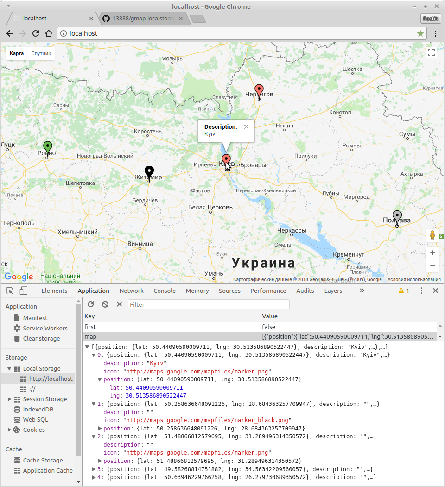

# gmap-localstorage.js
A map with the ability to create, edit, delete a marker and its description

## functions
- create marker
- show description when you hover
- dragging (move and save)
- edit description
- change marker color
- data storage in localstorage

## run
```bash
git clone https://github.com/13338/lblog.git
```
Replace the `YOUR_API_KEY` (index.html) with your own api key

## preview

